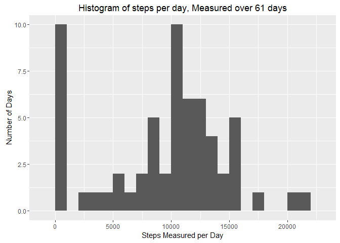
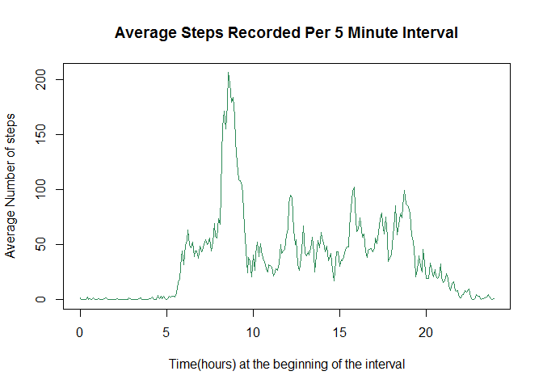
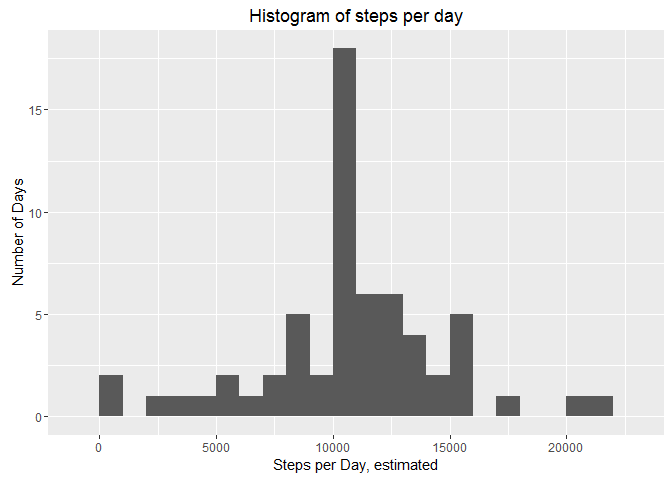
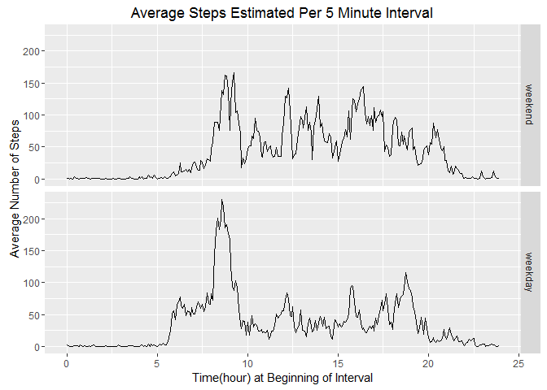

# Reproducible Research: Peer Assessment 1
##Introduction:
This assignment uses data from collected from a personal activity monitoring device, which measured movement of an anonymous individual, over the course of the 61 days comprising October and November 2012. Pedometer data was collected at 5 minute intervals through out the day. 

#####R Code Notes:

The script requires use of the following libraries: data.table, ggplot2.  

This code assumes that par() is set to default at the beginning of the script. Other settings might produce less effective plots.


```r
#Remove for submission:
setwd("C:/Users/Michelle/Desktop/Coursera/Reproducible_Research/Week_1/RepData_PeerAssessment1-master")
```


## Loading and preprocessing the data
1. Loading the data
The data may be loaded from the URL shown below. Data for this analysis was downloaded on March 2, 2016.

```r
#Check if files are present in the working directory, and download them if they are not.

if(!file.exists("activity.csv")){
  temp<-tempfile()
  activity_monitoring_url<-"https://d396qusza40orc.cloudfront.net/repdata%2Fdata%2Factivity.zip"
  download.file(activity_monitoring_url, temp)
  unzip(temp)
  unlink(temp)}

activity <- read.csv("activity.csv", stringsAsFactors = FALSE, na.strings = "NA")
```

2. Process data to prepare it for analysis


```r
#change the "date" variable from character format to date format. 
activity$date <- as.Date(activity$date, "%Y-%m-%d") 

#The "interval" variable might be more appropriate as a time than as a integer.
  #Perhaps there's a better way to do this that's more compatible with plotting.
library(data.table)
activity$interval<-as.character(sprintf("%04d",activity$interval))
activity$interval<-as.ITime(activity$interval, format = "%H%M")
```


## What is mean total number of steps taken per day?
#####Missing values will be ignored at this point.
1. Make a histogram of the total number of steps taken each day

```r
#Calculate total steps per day:
steps_per_day<-unlist(lapply(with(activity, split(steps, date)), 
                                        sum, na.rm = TRUE))

#Make the histogram:
    library(ggplot2)
    
    qplot(steps_per_day,
            binwidth = 1000,
            main = "Histogram of steps per day, Measured over 61 days", 
            xlab = "Steps Measured per Day",
            ylab = "Number of Days"
            ) 
```

\
    
2. Calculate the mean and median total number of steps taken each day:

```r
    mean(steps_per_day)
```

```
## [1] 9354.23
```

```r
    median(steps_per_day)
```

```
## [1] 10395
```

This individual took an average of 9354.2 steps per day during the period of data collections. The median number of steps per day was slightly higher, at 10395. This reflects what is seen in the histogram: on many days, zero steps were recorded. Missing data should be suspected.

## What is the average daily activity pattern?
1. Make a time series plot of the 5-minute interval and the average number of steps taken, averaged across all days.

```r
    #find the average number of steps in each interval
    avg_steps<-aggregate(activity, by = list(activity$interval), 
                              FUN = mean, na.rm = TRUE)
    plot(avg_steps$Group.1/3600, avg_steps$steps, 
                type = "l",
                col = "seagreen4",
                main = "Average Steps Recorded Per 5 Minute Interval",
                ylab = "Average Number of steps",
                xlab = "Time(hours) at the beginning of the interval")
```

\

2. Which daily interval has the maximum mean number of steps?
   

```r
    daily_max_average<-subset(avg_steps, steps == max (steps))[, 1]
    daily_max_average
```

```
## [1] "08:35:00"
```
The interval with maximum mean number of steps starts at 8:35am.

## Imputing missing values
1. How many rows contain missing values?

```r
  sum(!complete.cases(activity))
```

```
## [1] 2304
```

```r
  sum(!complete.cases(activity))/nrow(activity)
```

```
## [1] 0.1311475
```
There are 2304 rows with missing values. This is 13.1% of the dataset.
    
2. Devise a strategy for filling in all of the missing values in the dataset. 

I will replace missing values with the mean number of steps for that interval, averaged across all 61 days in the dataset. I already created the data frame that contains the replacement values.

3. Create a new dataset that is equal to the original dataset but with the missing data filled in.


```r
    #change variable names for smoother merge
    names(avg_steps)<-c("interval","average_steps","date2","interval2")

    #merge datasets
    activity_merged<-merge(activity, avg_steps, by = "interval")

    #replace NA with the mean for that time interval
    for(i in 1:nrow(activity_merged)){
      if (is.na(activity_merged[i, 2])){
        activity_merged[i, 2]<-activity_merged[i, 4]
      }
    } 
  
    #select only the desired variables
    activity_imputed<-activity_merged[,1:3]
```

4. Make a histogram showing steps taken per day, using the data with imputed values to replace NA. Also, use the dataset with imputed values to find the mean and median number of steps per day. 


```r
steps_per_day_imputed<-unlist(lapply(with(activity_imputed, split(steps, date)), 
                            sum, na.rm = TRUE))

#Make a histogram plot of steps per day:
    library(ggplot2)
    
    qplot(steps_per_day_imputed,
            binwidth = 1000,
            main = "Histogram of steps per day", 
            xlab = "Steps per Day, estimated",
            ylab = "Number of Days"
            ) 
```

\


```r
    mean(steps_per_day_imputed)
```

```
## [1] 10766.19
```

```r
    median(steps_per_day_imputed)
```

```
## [1] 10766.19
```

The mean total number of steps taken per day is 10766.19, when corrected for missing values; the median number of steps taken per day is also 10766.19.

## Are there differences in activity patterns between weekdays and weekends?
1. Create a new factor variable in the dataset to indicate if the date is on a weekday or weekend.


```r
  #create the day_type variable.
  activity_imputed$day_type <-0
  weekends<-c("Saturday", "Sunday")
  weekdays<-c("Monday", "Tuesday","Wednesday","Thursday","Friday")

  for(i in 1:nrow(activity_imputed)){
  if (weekdays(activity_imputed[i,3]) %in% weekends){
    activity_imputed[i,4]<-"weekend"} else 
    if(weekdays(activity_imputed[i,3]) %in% weekdays){
    activity_imputed[i,4]<-"weekday"} else{
    activity_imputed[i,4]<-NA
    }
  }
```

2. Make a panel plot containing a time series plot of the 5-minute interval and the average number of steps taken, averaged across all weekday days or weekend days. 


```r
      #find the average number of steps in each interval
      
      weekend_activity<-subset(activity_imputed, day_type == "weekend")
      weekday_activity<-subset(activity_imputed, day_type == "weekday")
      
          avg_steps_weekend<-aggregate(weekend_activity$steps, 
                              by = list(weekend_activity$interval), 
                              FUN = mean, na.rm = TRUE)
          avg_steps_weekday <-aggregate(weekday_activity$steps, 
                              by=list(weekday_activity$interval), 
                              FUN = mean, na.rm= TRUE)
      #restore the day_type variable, combine the datasets, and improve col names.
        avg_steps_weekday$day_type<-factor("weekday")
        avg_steps_weekend$day_type<-factor("weekend")                    
        avg_steps_by_daytype<-rbind(avg_steps_weekend, avg_steps_weekday)
        names(avg_steps_by_daytype)<-c("interval", "mean_steps", "day_type")
          
      #make a panel plot, using ggplot2
        library(ggplot2)
      
qplot(interval/3600, mean_steps, data=avg_steps_by_daytype, 
      facets=day_type~., 
      geom="line", 
      xlab="Time(hour) at Beginning of Interval", 
      ylab="Average Number of Steps", 
      main="Average Steps Estimated Per 5 Minute Interval") 
```

```
## Don't know how to automatically pick scale for object of type ITime. Defaulting to continuous
```

\


##Final Notes
This analysis indicates that the subject walked an average of ~10K steps per day. This is a level of physical activity that is [recommended by various fitness groups, with some controversy](http://nymag.com/scienceofus/2015/06/how-many-steps-a-day-really-walk.html). Daily activity started earlier on weekdays than on weekends, and also subsides earlier on weekdays than on weekends. There was an early peak of daily activity on weekdays (at 8:30am) that is not pronounced on weekends.

Imputation to replace missing values was used, but possibly in a way that is not particularly valid. Ideally, we would assess if the missing data were MCAR(missing completely at random) or MNAR(missing not at random) before attempting imputation. Please consider [further reading](http://www.r-bloggers.com/imputing-missing-data-with-r-mice-package/) on this subject.

####Final R Code Notes
Alternative methods of formatting the interval variable should be pursued; the current format is difficult to properly apply to axes in plots.

This report answers week 1 homework questions for Reproducible Research.  Reproducible Research is a class offered by John Hopkins University through Coursera:    https://www.coursera.org/learn/reproducible-research/.  

This file was obtained from Dr. Peng's github repo on March 2, 2016; It is available at:    https://github.com/rdpeng/RepData_PeerAssessment1.

This file was last edited by Michelle Birt Leeds on March 3, 2016.  
